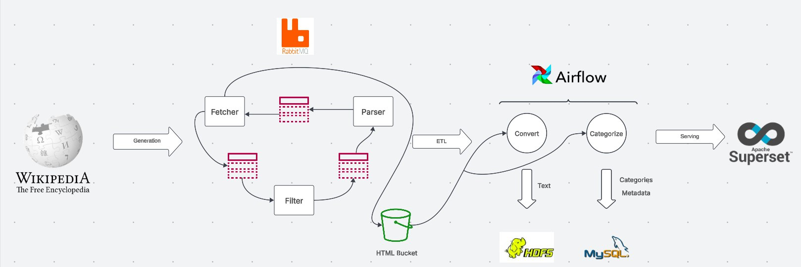

# Wikipedia ETL Project

## Overview
This project is designed to simulate the full lifecycle of a data engineer work. It consists of multiple stages, including data generation, transformation, storage, and visualization. The project is built in a microservices structure with RabbitMQ for communication and leverages PySpark, Airflow, MySQL, HDFS, and Apache Superset for data analysis.

## Project Structure
1. **Wikipedia Scraper**
   - A microservices-based scraper fetches Wikipedia pages.
   - Communication between services is handled using RabbitMQ.
   - Extracted HTML content is saved to local storage.
   - Services are containerized using Docker Compose.

2. **Data Injection & Transformation**
   - PySpark tasks process the extracted Wikipedia pages.
   - Orchestration is handled using Apache Airflow.
   - Two processing tasks for each Wikipedia page:
     - **Category Extraction**: Extracts a list of categories from the page and stores them in MySQL using SQLAlchemy. If the necessary tables do not exist, they are created.
     - **Text Extraction**: Extracts the full text from the page and stores it in HDFS.

3. **Data Analysis & Visualization**
   - **Category Distribution**: Visualized using Apache Superset.
   - **Sentiment Analysis**: A planned feature to analyze the sentiment of extracted text to detect neutrality and filter inappropriate content.

## Business Value
- Identifying trends in newly created Wikipedia pages.
- Filtering non-neutral or inappropriate content.

## Technologies Used
- **Scraping & Microservices**: Python, RabbitMQ, Docker Compose
- **Data Processing**: PySpark, Apache Airflow
- **Storage**: MySQL (for category data), HDFS (for text content)
- **Visualization**: Apache Superset
- **Future Plans**: Sentiment analysis, migration to AWS S3 for storage

## Current Status
This project is not fully complete but serves as a hands-on practice for ETL workflows and database integration.

## Future Improvements
- Implement sentiment analysis.
- Move services to cloud: use S3 instead of local storage, Glue with MWAA for processing, RedShift as an OLAP 
- Implement update fetching of existing pages.

